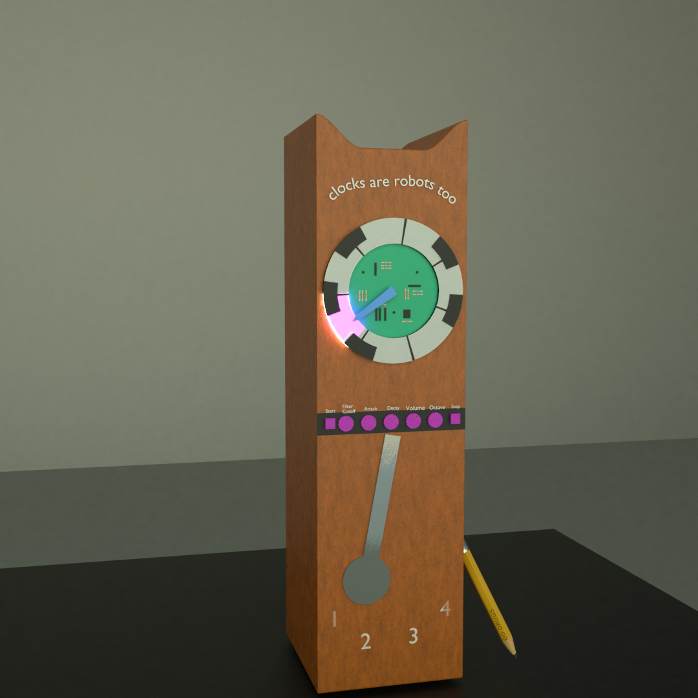

# clocks_are_robots
## ECE3872 musical robot team 5B 

Tinkercad Simulation of Arduino and circuity:  
https://www.tinkercad.com/things/kZ8lBtSx1vj-copy-of-ece3872-time-zeeper/editel?sharecode=Mxh5uRSaNloz5li4VxAIo-LYPFh9B_5_VCMgjHP5ZlA

**Arduino Pinouts**

A0 - Audio in  
A1 - Enveloped audio in 
A2 - Octave knob  
  
[D4 - D7] are for stepper motor 
D4 - AIn1 
D5 - Ain2 
D6 - Bin1 
D7 - Bin2 
D8 - Start/Stop Button 
D9 - Tone out  
D10 - Servo out 
D12 - Neopixel LED out 